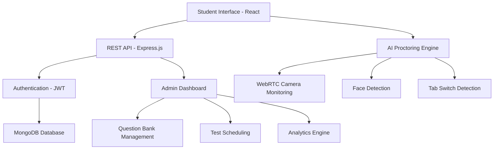
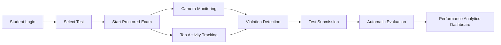
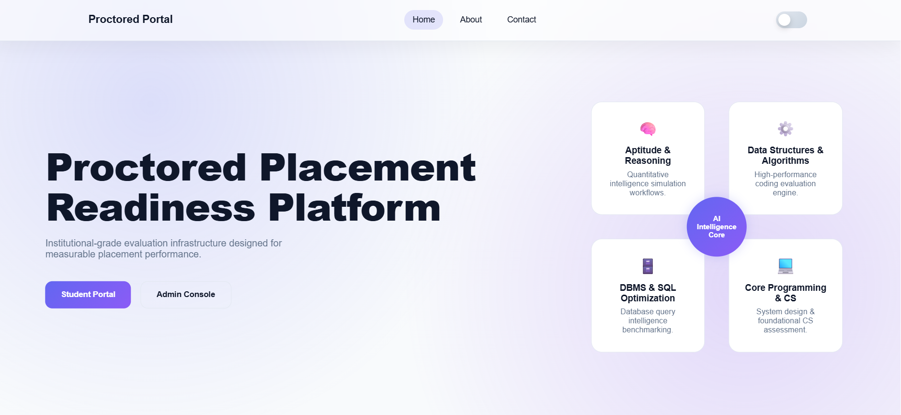

<!-- PROJECT BANNER -->

<div align="center">


### 🧠 AI Powered Recruitment Simulation Platform  
### 🎯 Simulating Real Placement Drives with AI Proctoring

<br>


<br>


<br>


</div>

---

# 🎥 Demo

*(Add a demo GIF of your test interface here)*

```
/demo/demo.gif
```

Example:


---

# 🏗 System Architecture



---

# 🧪 Test Simulation Flow



---

# 📊 Platform Capabilities

| Capability | Description |
|------|------|
| AI Proctoring | Detects suspicious behaviour |
| Company Simulation | Mimics real recruitment exams |
| Analytics Dashboard | Topic-wise readiness tracking |
| Test Monitoring | Tab switch + camera tracking |
| Automated Evaluation | Instant scoring system |

---

# 🏢 Simulated Company Patterns

The portal replicates recruitment assessments of:

- **TCS**
- **IBM**
- **Accenture**
- **Wipro**
- **Deloitte**

Each simulation includes:

- Difficulty distribution  
- Topic weightage  
- Section structure  
- Time constraints  

---

# 📸 Screenshots

```
/screenshots
   ├── home.png
   ├── dashboard.png
   ├── test-page.png
   ├── analytics.png
```

| Home | Dashboard |
|-----|-----|
|  |  |

| Test Interface | Analytics |
|-----|-----|
|  |  |

---

<div align="center">

⭐ If you find this project useful, please consider giving it a star ⭐

</div>
